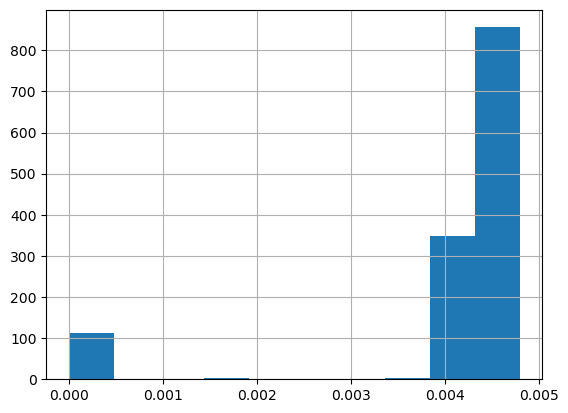
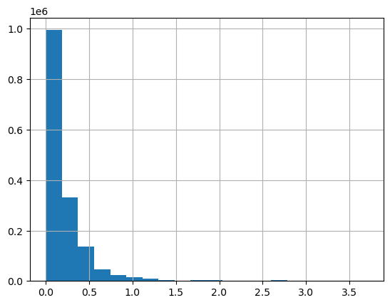

Metadata provided with the published Los Alamos Public Utility Department Smart Meter dataset at Dryad <https://doi.org/10.5061/dryad.m0cfxpp2c> indicates that aside from de-identification the data have not been pre-processed or normalized and may include missing data, duplicate entries, and other anomalies.

The full dataset is too large for this tutorial format. The subset used for the lesson has been cleaned to elminate null and duplicate values, but may still contain outliers or erroneous meter readings. One way to identify potential errors within a dataset is to inspect the data using descriptive statistics. 

## Descriptive Statistics

Descriptive statistics provide us with a means to summarize large datasets, and to identify the presence of outliers, missing data, etc.

First, import Pandas and the ```glob``` library, which provides utilities for generating lists of files that match specific file name patterns.

~~~
import pandas as pd
import glob
~~~
{: .language-python}

Next, use the ```glob``` function to create a list of files that Pandas will combine into a single data frame.

~~~
file_list = glob.glob("../data/*.csv")
file_list
~~~
{: .language-python}
~~~
['../data\\ladpu_smart_meter_data_01.csv',
 '../data\\ladpu_smart_meter_data_02.csv',
 '../data\\ladpu_smart_meter_data_03.csv',
 '../data\\ladpu_smart_meter_data_04.csv',
 '../data\\ladpu_smart_meter_data_05.csv',
 '../data\\ladpu_smart_meter_data_06.csv',
 '../data\\ladpu_smart_meter_data_07.csv',
 '../data\\ladpu_smart_meter_data_08.csv',
 '../data\\ladpu_smart_meter_data_09.csv',
 '../data\\ladpu_smart_meter_data_10.csv',
 '../data\\ladpu_smart_meter_data_11.csv',
 '../data\\ladpu_smart_meter_data_12.csv',
 '../data\\ladpu_smart_meter_data_13.csv',
 '../data\\ladpu_smart_meter_data_14.csv',
 '../data\\ladpu_smart_meter_data_15.csv']
~~~
{: .output}

As before, concatenate all of the individual CSV files into a single dataframe and reset the index.

~~~
data = pd.concat([pd.read_csv(f) for f in file_list])
data.reset_index(inplace=True, drop=True)
print(data.axes)
~~~
{: .language-python}
~~~
[RangeIndex(start=0, stop=1575180, step=1), Index(['INTERVAL_TIME', 'METER_FID', 'START_READ', 'END_READ',
       'INTERVAL_READ'],
      dtype='object')]
~~~
{: .output}

~~~
print(data.info())
~~~
{: .language-python}
~~~
<class 'pandas.core.frame.DataFrame'>
RangeIndex: 1575180 entries, 0 to 1575179
Data columns (total 5 columns):
 #   Column         Non-Null Count    Dtype  
---  ------         --------------    -----  
 0   INTERVAL_TIME  1575180 non-null  object 
 1   METER_FID      1575180 non-null  int64  
 2   START_READ     1575180 non-null  float64
 3   END_READ       1575180 non-null  float64
 4   INTERVAL_READ  1575180 non-null  float64
dtypes: float64(3), int64(1), object(1)
memory usage: 60.1+ MB
None

~~~
{: .output}

In a later episode we will create a datetime index using the *INTERVAL_TIME* field. For now we will change the data type of *INTERVAL_TIME* to *datetime* and store the updated data in an *iso_date* column. 

~~~
data["iso_date"] = pd.to_datetime(data["INTERVAL_TIME"], infer_datetime_format=True)
print(data.info())
~~~
{: .language-python}
~~~
<class 'pandas.core.frame.DataFrame'>
RangeIndex: 1575180 entries, 0 to 1575179
Data columns (total 6 columns):
 #   Column         Non-Null Count    Dtype         
---  ------         --------------    -----         
 0   INTERVAL_TIME  1575180 non-null  object        
 1   METER_FID      1575180 non-null  int64         
 2   START_READ     1575180 non-null  float64       
 3   END_READ       1575180 non-null  float64       
 4   INTERVAL_READ  1575180 non-null  float64       
 5   iso_date       1575180 non-null  datetime64[ns]
dtypes: datetime64[ns](1), float64(3), int64(1), object(1)
memory usage: 72.1+ MB
None

~~~
{: .output}

The output of the ```info()``` method above indicates that four of the columns in the dataframe have numeric data types: "METER\_FID", "START\_READ", "END\_READ", and "INTERVAL\_READ". By default, Pandas will calculate descriptive statistics for numeric data types within a dataset.

~~~
print(data.describe())
~~~
{: .language-python}
~~~
          METER_FID    START_READ      END_READ  INTERVAL_READ
count  1.575180e+06  1.575180e+06  1.575180e+06   1.575180e+06
mean   2.357953e+04  3.733560e+04  3.734571e+04   2.322766e-01
std    1.414977e+04  1.877812e+04  1.877528e+04   3.026917e-01
min    2.850000e+02  7.833000e+00  7.833000e+00   0.000000e+00
25%    1.006300e+04  2.583424e+04  2.584509e+04   8.820000e-02
50%    2.419700e+04  3.399917e+04  3.401764e+04   1.452000e-01
75%    3.503400e+04  4.391686e+04  4.393681e+04   2.490000e-01
max    4.501300e+04  9.997330e+04  9.997330e+04   3.709200e+00
~~~
{: .output}

Since the values for "START\_READ" and "END\_READ" are calculated across fifteen different meters over a period of three years, those statistics may not be useful or of interest. Without grouping or otherwise manipulating the data, the only statistics that may be informative in the aggregate are for the "INTERVAL\_READ" variable. This is the variable that measures actual power consumption per time intervals of 15 minutes.

Also note that "METER\_FID" is treated as an integer by Pandas. This is reasonable, since the identifiers are whole numbers. However, since these identifiers aren't treated numerically in our analysis we can change the data type to *object*. We will see below how this affects the way statistics are calculated.

~~~
data = data.astype({"METER_FID": "object"})
print(data.dtypes)
~~~
{: .language-python}
~~~
INTERVAL_TIME            object
METER_FID                object
START_READ              float64
END_READ                float64
INTERVAL_READ           float64
iso_date         datetime64[ns]
dtype: object
~~~
{: .output}

If we re-run the code ```print(data.describe())``` as above, Pandas will now exclude information about "METER\_FID", since by default Pandas only outputs descriptive statistics for numeric data types. We can change the default behavior to include statistics for all columns. 

~~~
print(data.describe(include="all", datetime_is_numeric=True))
~~~
{: .language-python}
~~~
              INTERVAL_TIME  METER_FID    START_READ      END_READ  \
count               1575180  1575180.0  1.575180e+06  1.575180e+06   
unique               105012       15.0           NaN           NaN   
top     2017-01-01 00:00:00      285.0           NaN           NaN   
freq                     15   105012.0           NaN           NaN   
mean                    NaN        NaN  3.733560e+04  3.734571e+04   
min                     NaN        NaN  7.833000e+00  7.833000e+00   
25%                     NaN        NaN  2.583424e+04  2.584509e+04   
50%                     NaN        NaN  3.399917e+04  3.401764e+04   
75%                     NaN        NaN  4.391686e+04  4.393681e+04   
max                     NaN        NaN  9.997330e+04  9.997330e+04   
std                     NaN        NaN  1.877812e+04  1.877528e+04   

        INTERVAL_READ                       iso_date  
count    1.575180e+06                        1575180  
unique            NaN                            NaN  
top               NaN                            NaN  
freq              NaN                            NaN  
mean     2.322766e-01  2018-07-02 20:14:16.239287296  
min      0.000000e+00            2017-01-01 00:00:00  
25%      8.820000e-02            2017-10-02 12:11:15  
50%      1.452000e-01            2018-07-03 00:22:30  
75%      2.490000e-01            2019-04-02 12:33:45  
max      3.709200e+00            2019-12-31 23:45:00  
std      3.026917e-01                            NaN  
~~~
{: .output}

For non-numeric data types, Pandas has included statistics for *count*, *unique*, *top*, and *freq*. Respectively, these represent the total number of observations, the number of uniquely occuring values, the most commonly occuring value, and the number of time the most commonly occurring value appears in the dataset.

We can view the descriptive statistics for a single column:

~~~
print(data["INTERVAL_READ"].describe())
~~~
{: .language-python}
~~~
count    1.575180e+06
mean     2.322766e-01
std      3.026917e-01
min      0.000000e+00
25%      8.820000e-02
50%      1.452000e-01
75%      2.490000e-01
max      3.709200e+00
Name: INTERVAL_READ, dtype: float64
~~~
{: .output}

We notice the difference between the value given for 75% range and the maximum meter reading is larger than the differences between the other percentiles. For a closer inspection of high readings, we can also specify percentiles.

~~~
print(data["INTERVAL_READ"].describe(percentiles = [0.75, 0.85, 0.95, 0.99]))
~~~
{: .language-python}
~~~
count    1.575180e+06
mean     2.322766e-01
std      3.026917e-01
min      0.000000e+00
50%      1.452000e-01
75%      2.490000e-01
85%      3.846000e-01
95%      6.912000e-01
99%      1.714926e+00
max      3.709200e+00
Name: INTERVAL_READ, dtype: float64
~~~
{: .output}

There seem to be some meter readings that are unusually high between the 95% percentile and the maximum. We will investgate this in more detail below.

> ## Challenge: Descriptive Statistics by Data Type
>
> We have seen that the default behavior in Pandas is to output descriptive statistics for 
> numeric data types. It is also possible, using the ```include``` argument demonstrated 
> above, to output descriptive statistics for specific data types.
> 
> Write some code to output descriptive statistics by data type for each of the data
> types in the dataset. Refer to python data types documentation and use any of 
> the methods we have demonstrated to identify the data types of different 
> columns in a pandas dataframe.
>
> > ## Solution
> > ~~~
> > print("Dataframe info:")
> > print(data.info())
> > 
> > Dataframe info:
> > <class 'pandas.core.frame.DataFrame'>
> > RangeIndex: 1575180 entries, 0 to 1575179
> > Data columns (total 6 columns):
> >  #   Column         Non-Null Count    Dtype         
> > ---  ------         --------------    -----         
> >  0   INTERVAL_TIME  1575180 non-null  object        
> >  1   METER_FID      1575180 non-null  object        
> >  2   START_READ     1575180 non-null  float64       
> >  3   END_READ       1575180 non-null  float64       
> >  4   INTERVAL_READ  1575180 non-null  float64       
> >  5   iso_date       1575180 non-null  datetime64[ns]
> > dtypes: datetime64[ns](1), float64(3), object(2)
> > memory usage: 72.1+ MB
> > None
> >
> > print("Descriptive stats for floating point numbers:")
> > print(data.describe(include=float))
> > 
> > Descriptive stats for floating point numbers:
> >          START_READ      END_READ  INTERVAL_READ
> > count  1.575180e+06  1.575180e+06   1.575180e+06
> > mean   3.733560e+04  3.734571e+04   2.322766e-01
> > std    1.877812e+04  1.877528e+04   3.026917e-01
> > min    7.833000e+00  7.833000e+00   0.000000e+00
> > 25%    2.583424e+04  2.584509e+04   8.820000e-02
> > 50%    3.399917e+04  3.401764e+04   1.452000e-01
> > 75%    4.391686e+04  4.393681e+04   2.490000e-01
> > max    9.997330e+04  9.997330e+04   3.709200e+00
> > 
> > print("Descriptive stats for objects:")
> > print(data.describe(include=object))
> >
> > Descriptive stats for objects:
> >               INTERVAL_TIME  METER_FID
> > count               1575180    1575180
> > unique               105012         15
> > top     2017-01-01 00:00:00        285
> > freq                     15     105012
> > ~~~
> > {: .output}
> {: .solution}
{: .challenge}
 

### Working with Values

Returning to our descriptive statistics, we have already noted that the maximum value is well above the 99th percentile. Our minimum value of zero may also be unusual, since many homes might be expected to use some amount of energy every fifteen minutes, even when residents are away. 

~~~
print(data["INTERVAL_READ"].describe())
~~~
{: .language-python}
~~~
count    1.575180e+06
mean     2.322766e-01
std      3.026917e-01
min      0.000000e+00
25%      8.820000e-02
50%      1.452000e-01
75%      2.490000e-01
max      3.709200e+00
Name: INTERVAL_READ, dtype: float64
~~~
{: .output}

We can also select the minimum and maximum values in a column using the ```min()``` and ```max()``` functions.

~~~
print("Minimum value:", data["INTERVAL_READ"].min())
print("Maximum value:", data["INTERVAL_READ"].max())
~~~
{: .language-python}
~~~
Minimum value: 0.0
Maximum value: 3.7092
~~~
{: .output}

This is useful if we want to know what those values are. We may want to have more information about the corresponding meter's start and end reading, the date, and the meter ID. One way to discover this information is to use the ```idxmin()``` and ```idxmax()``` functions to get the position indices of the rows where the minimum and maximum values occur.

~~~
print("Position index of the minimum value:", data["INTERVAL_READ"].idxmin())
print("Position index of the maximum value:", data["INTERVAL_READ"].idxmax())
~~~
{: .language-python}
~~~
Position index of the minimum value: 31315
Position index of the maximum value: 1187650
~~~
{: .output}

Now we can use the position index to select the row with the reported minimum value.

~~~
print(data.iloc[31315])
~~~
{: .language-python}
~~~
INTERVAL_TIME    2017-11-24 05:45:00
METER_FID                        285
START_READ                 18409.997
END_READ                   18418.554
INTERVAL_READ                    0.0
iso_date         2017-11-24 05:45:00
Name: 31315, dtype: object
~~~
{: .output}

We can do the same with the maximum value.

~~~
print(data.iloc[1187650])
~~~
{: .language-python}
~~~
INTERVAL_TIME    2017-12-06 18:30:00
METER_FID                      29752
START_READ                 99685.954
END_READ                   99788.806
INTERVAL_READ                 3.7092
iso_date         2017-12-06 18:30:00
Name: 1187650, dtype: object
~~~
{: .output}

An important caveat here is that in both cases, the ```idxmin()``` and ```idxmax()``` functions return a single position index number, when in fact the minimum and maximum values may occur multiple times. We can use the ```value_counts()``` function to demonstrate that 0 occurs several times in the dataset. Since the dataset is large, we will first subset the data to only include meter readings with very small intervals. Then we will get the count of values across the subset.

~~~
low_readings = data[data["INTERVAL_READ"] <= 0.005].copy()
print(pd.value_counts(low_readings["INTERVAL_READ"]))
~~~
{: .language-python}
~~~
0.00480    856
0.00420    349
0.00000     72
0.00001     40
0.00360      3
0.00354      1
0.00177      1
0.00240      1
0.00180      1
0.00294      1
Name: INTERVAL_READ, dtype: int64
~~~
{: .output}

It's also helpful to visualize the distribution of values. Pandas has a ```hist()``` function for this.

~~~
low_readings["INTERVAL_READ"].hist()
~~~
{: .language-python}



We can plot the distribution of *INTERVAL_READ* values across the entire dataset. Note that the default behavior in this case is to group the values into 10 *bins*. The number of bins can be specified using the *bins* argument. 

~~~
data["INTERVAL_READ"].hist(bins-20)
~~~
{: .language-python}




To find the number of rows with "INTERVAL\_READ" values equal to the minimum or maximum value of that column, we can also create a subset of rows with that value and then get the length of the subset.

~~~
print("Number of rows with minimum interval read values:", len(data[data["INTERVAL_READ"] == data["INTERVAL_READ"].min()]))
print("Number of rows with maximum interval read values:", len(data[data["INTERVAL_READ"] == data["INTERVAL_READ"].max()]))
~~~
{: .language-python}
~~~
Number of rows with minimum interval read values: 72
Number of rows with maximum interval read values: 1
~~~
{: .output}


