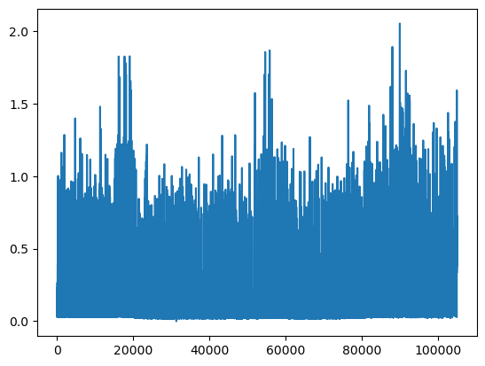
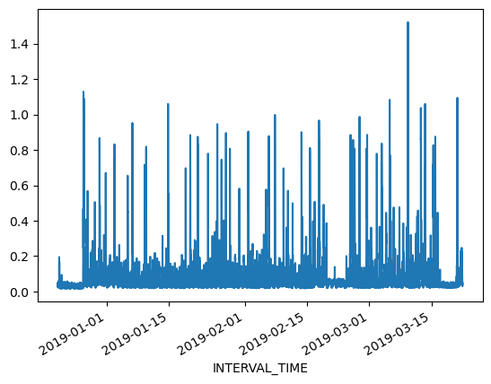
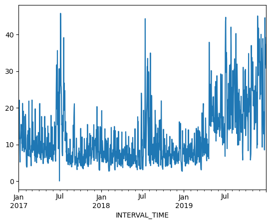

So far we have been interacting with the time series data in ways that are not very different from other tabular datasets. However, time series data can contain unique features that make it difficult to analyze aggregate statistics. For example, the sum of power consumption as measured by a single smart meter over the course of three years may be useful in a limited context, but if we want to analyze the data in order to make predictions about likely demand within one or more households at a given time, we need to account for time features including.

- **trends**
- **seasonality**

In this episode, we will use Pandas' datetime indexing features to illustrate these features.

### Setting a datetime index

To begin with we will demonstrate datetime indexing with data from a single meter. First, let's import the necessary libraries.

~~~
import pandas as pd
import matplotlib.pyplot as plt
import glob
import numpy as np
~~~
{: .language-python}

Create the file list as before, but this time read only the first file.

~~~
file_list = glob.glob("../data/*.csv")
data = pd.read_csv(file_list[0])
print(data.info())
~~~
{: .language-python}
~~~
<class 'pandas.core.frame.DataFrame'>
RangeIndex: 105012 entries, 0 to 105011
Data columns (total 5 columns):
 #   Column         Non-Null Count   Dtype  
---  ------         --------------   -----  
 0   INTERVAL_TIME  105012 non-null  object 
 1   METER_FID      105012 non-null  int64  
 2   START_READ     105012 non-null  float64
 3   END_READ       105012 non-null  float64
 4   INTERVAL_READ  105012 non-null  float64
dtypes: float64(3), int64(1), object(1)
memory usage: 4.0+ MB
None
~~~
{: .output}

We can plot the *INTERVAL_READ* values without making any changes to the data. In the image below, we observe what may be trends or seasonality. But we are able to infer this based on our understanding of the data - note that the labels of the X index in the image are the row index positions, not date information.

~~~
data["INTERVAL_READ"].plot()
~~~
{: .language-python}



The plot is difficult to read because it is dense. Recall that meter readings are taken every 15 minutes, for a total in the case of this meter of 105,012 readings across the three years of data included in the dataset. In the plot above, we have asked Pandas to plot the value of each one of those readings - that's a lot of points!

In order to reduce the amount of information and inspect the data for trends and seasonality, the first thing we need to do is set the index of the dataframe to use the *INTERVAL_TIME* column as a datetime index. 

~~~
data.set_index(pd.to_datetime(data['INTERVAL_TIME']), inplace=True)
print(data.info())
~~~
{: .language-python}
~~~
<class 'pandas.core.frame.DataFrame'>
DatetimeIndex: 105012 entries, 2017-01-01 00:00:00 to 2019-12-31 23:45:00
Data columns (total 5 columns):
 #   Column         Non-Null Count   Dtype  
---  ------         --------------   -----  
 0   INTERVAL_TIME  105012 non-null  object 
 1   METER_FID      105012 non-null  int64  
 2   START_READ     105012 non-null  float64
 3   END_READ       105012 non-null  float64
 4   INTERVAL_READ  105012 non-null  float64
dtypes: float64(3), int64(1), object(1)
memory usage: 4.8+ MB
None
~~~
{: .output}

Note that the output of the ```info()``` function indicates the index is now a *DatetimeIndex.* However, the *INTERVAL_TIME* column is still listed as a column, with a data type of *object* or string.

~~~
print(data.head())
~~~
{: .language-python}
~~~
                           INTERVAL_TIME  METER_FID  START_READ   END_READ  \
INTERVAL_TIME                                                                
2017-01-01 00:00:00  2017-01-01 00:00:00        285   14951.787  14968.082   
2017-01-01 00:15:00  2017-01-01 00:15:00        285   14968.082  14979.831   
2017-01-01 00:30:00  2017-01-01 00:30:00        285   14968.082  14979.831   
2017-01-01 00:45:00  2017-01-01 00:45:00        285   14968.082  14979.831   
2017-01-01 01:00:00  2017-01-01 01:00:00        285   14968.082  14979.831   

                     INTERVAL_READ  
INTERVAL_TIME                       
2017-01-01 00:00:00         0.0744  
2017-01-01 00:15:00         0.0762  
2017-01-01 00:30:00         0.1050  
2017-01-01 00:45:00         0.0636  
2017-01-01 01:00:00         0.0870  
~~~
{: .output}

### Slicing data by date

Now that we have a datetime index for our dataframe, we can use date and time components as labels for label based indexing and slicing. We can use all or part of the datetime information, dependng on how we want to subset the data.

To select data for a single day, we can slice using the date.

~~~
one_day_data = data.loc["2017-08-01"].copy()
print(one_day_data.info())
~~~
{: .language-python}
~~~
<class 'pandas.core.frame.DataFrame'>
DatetimeIndex: 96 entries, 2017-08-01 00:00:00 to 2017-08-01 23:45:00
Data columns (total 5 columns):
 #   Column         Non-Null Count  Dtype  
---  ------         --------------  -----  
 0   INTERVAL_TIME  96 non-null     object 
 1   METER_FID      96 non-null     int64  
 2   START_READ     96 non-null     float64
 3   END_READ       96 non-null     float64
 4   INTERVAL_READ  96 non-null     float64
dtypes: float64(3), int64(1), object(1)
memory usage: 4.5+ KB
None
~~~
{: .output}

The ```info()``` output above shows that the subset includes 96 readings for a single day, and that the readings were taken between 12AM and 23:45PM. This is expected, based on the structure of the data.

The ```head()``` command outputs the first five rows of data.

~~~
print(one_day_data.head())
~~~
{: .language-python}
~~~
                           INTERVAL_TIME  METER_FID  START_READ   END_READ  \
INTERVAL_TIME                                                                
2017-08-01 00:00:00  2017-08-01 00:00:00        285   17563.273  17572.024   
2017-08-01 00:15:00  2017-08-01 00:15:00        285   17572.024  17577.448   
2017-08-01 00:30:00  2017-08-01 00:30:00        285   17572.024  17577.448   
2017-08-01 00:45:00  2017-08-01 00:45:00        285   17572.024  17577.448   
2017-08-01 01:00:00  2017-08-01 01:00:00        285   17572.024  17577.448   

                     INTERVAL_READ  
INTERVAL_TIME                       
2017-08-01 00:00:00         0.0264  
2017-08-01 00:15:00         0.0432  
2017-08-01 00:30:00         0.0432  
2017-08-01 00:45:00         0.0264  
2017-08-01 01:00:00         0.0582  
~~~
{: .output}

We can inlcude timestamps in the label to subset the data to specific portions of a day. For example, we can inspect power consumption between 8AM and 17:00PM. In this case we use the syntax from before to specify a range for the slice.

~~~
print(data.loc["2017-08-01 00:00:00": "2017-08-01 17:00:00"])
~~~
{: .language-python}
~~~
                           INTERVAL_TIME  METER_FID  START_READ   END_READ  \
INTERVAL_TIME                                                                
2017-08-01 00:00:00  2017-08-01 00:00:00        285   17563.273  17572.024   
2017-08-01 00:15:00  2017-08-01 00:15:00        285   17572.024  17577.448   
2017-08-01 00:30:00  2017-08-01 00:30:00        285   17572.024  17577.448   
2017-08-01 00:45:00  2017-08-01 00:45:00        285   17572.024  17577.448   
2017-08-01 01:00:00  2017-08-01 01:00:00        285   17572.024  17577.448   
...                                  ...        ...         ...        ...   
2017-08-01 16:00:00  2017-08-01 16:00:00        285   17572.024  17577.448   
2017-08-01 16:15:00  2017-08-01 16:15:00        285   17572.024  17577.448   
2017-08-01 16:30:00  2017-08-01 16:30:00        285   17572.024  17577.448   
2017-08-01 16:45:00  2017-08-01 16:45:00        285   17572.024  17577.448   
2017-08-01 17:00:00  2017-08-01 17:00:00        285   17572.024  17577.448   

                     INTERVAL_READ  
INTERVAL_TIME                       
2017-08-01 00:00:00         0.0264  
2017-08-01 00:15:00         0.0432  
2017-08-01 00:30:00         0.0432  
2017-08-01 00:45:00         0.0264  
2017-08-01 01:00:00         0.0582  
...                            ...  
2017-08-01 16:00:00         0.0540  
2017-08-01 16:15:00         0.0288  
2017-08-01 16:30:00         0.0462  
2017-08-01 16:45:00         0.0360  
2017-08-01 17:00:00         0.0378  

[69 rows x 5 columns]
~~~
{: .output}

We can also slice by month or year. To subset all of the data from 2018 only requires us to include the year in the index label.

~~~
print(data.loc["2018"].info())
~~~
{: .language-python}
~~~
<class 'pandas.core.frame.DataFrame'>
DatetimeIndex: 35036 entries, 2018-01-01 00:00:00 to 2018-12-31 23:45:00
Data columns (total 5 columns):
 #   Column         Non-Null Count  Dtype  
---  ------         --------------  -----  
 0   INTERVAL_TIME  35036 non-null  object 
 1   METER_FID      35036 non-null  int64  
 2   START_READ     35036 non-null  float64
 3   END_READ       35036 non-null  float64
 4   INTERVAL_READ  35036 non-null  float64
dtypes: float64(3), int64(1), object(1)
memory usage: 1.6+ MB
None
~~~
{: .output}

The following would subset the data to include days that occurred during the northern hemisphere's winter of 2018-2019.

~~~
print(data.loc["2018-12-21": "2019-03-21"].info())
~~~
{: .language-python}
~~~
<class 'pandas.core.frame.DataFrame'>
DatetimeIndex: 8732 entries, 2018-12-21 00:00:00 to 2019-03-21 23:45:00
Data columns (total 5 columns):
 #   Column         Non-Null Count  Dtype  
---  ------         --------------  -----  
 0   INTERVAL_TIME  8732 non-null   object 
 1   METER_FID      8732 non-null   int64  
 2   START_READ     8732 non-null   float64
 3   END_READ       8732 non-null   float64
 4   INTERVAL_READ  8732 non-null   float64
dtypes: float64(3), int64(1), object(1)
memory usage: 409.3+ KB
None
~~~
{: .output}


### Resampling time series

Referring to the above slice of data from December 21, 2018 through March 21, 2019, we can also plot the meter reading values. The result is still noisy, as the plot includes 8732 values taken at 15 minute intervals during that time period. That is still a lot of data to put into a single plot.

~~~
print(data.loc["2018-12-21": "2019-03-21"]["INTERVAL_READ"].plot())
~~~
{: .language-python}




Alternatively, we can resample the data to convert readings to a different frequency. That is, instead of a reading every 15 minutes, we can resample to aggregate or group meter readings by hour, day, month, etc. The ```resample()``` method has one required argument, which specifies the frequency at which the data should be resampled. For example, to group the data by day, we use an uppercase "D" for this argument

~~~
daily_data = data.resample("D")
print(type(daily_data))
~~~
{: .language-python}
~~~
<class 'pandas.core.resample.DatetimeIndexResampler'>
~~~
{: .output}

Note that the data type of the resampled data is a *DatetimeIndexResampler*. This is similar to a *groupby* object in Pandas, and can be accessed using many of the same functions and methods. Previously, we used the ```max()``` and ```min()``` functions to retrieve maximum and minimum meter readings from the entire dataset. Having resampled the data, we can now retrieve these values per day. Be sure to specify the column against which we want to perform these operations.

~~~
print(daily_data['INTERVAL_READ'].min())
~~~
{: .language-python}
~~~
INTERVAL_TIME
2017-01-01    0.0282
2017-01-02    0.0366
2017-01-03    0.0300
2017-01-04    0.0288
2017-01-05    0.0288
               ...  
2019-12-27    0.0324
2019-12-28    0.0444
2019-12-29    0.0546
2019-12-30    0.0366
2019-12-31    0.0276
Freq: D, Name: INTERVAL_READ, Length: 1095, dtype: float64
~~~
{: .output}

We can also plot the results of operations, for example the daily total power consumption.

~~~
daily_data["INTERVAL_READ"].sum().plot()
~~~
{: .language-python}




